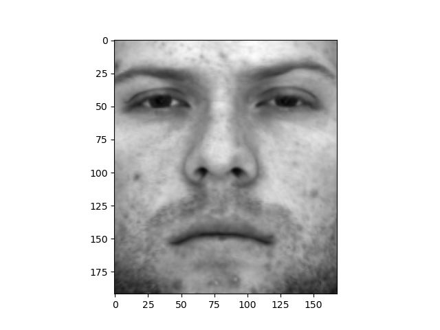
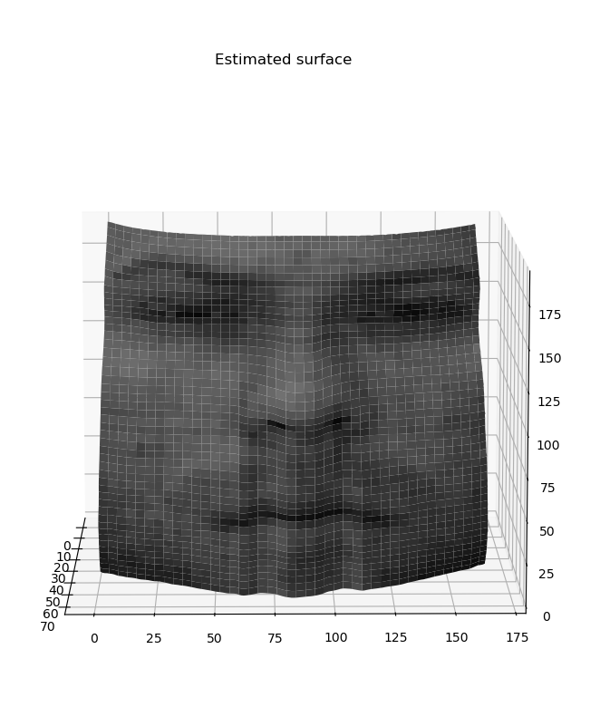
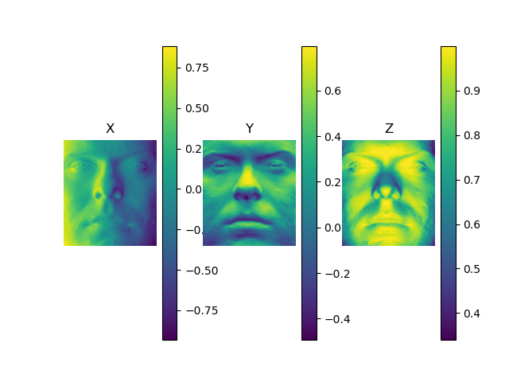

# Photometric-Stereo

Python code for performing Photometric Stereo on the given images using shape from shading algorithm.

Data folder contains images of four subjects each having 64 images taken from different angles with the same light source.

Output folder contains the albedo image, estimated surface normals and recovered surface of the four subjects.

Here is a sample output images.

<!--  -->
<h4>Albedo Image:</h4> 

<h4>Estimated Surface Normal:</h4> 

<h4>Integrated Height Map:</h4> 
